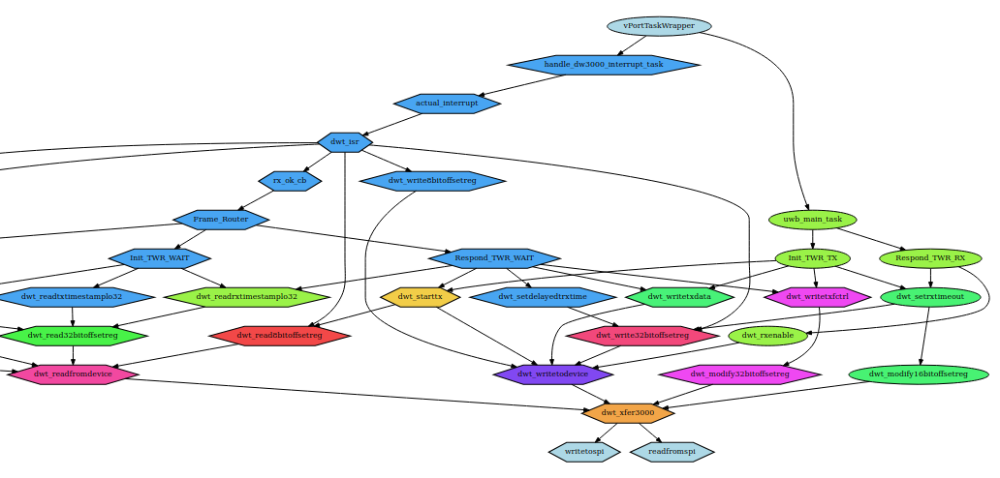
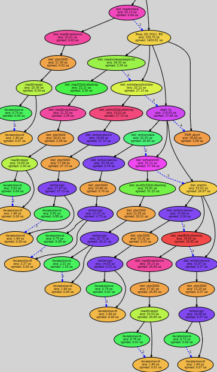
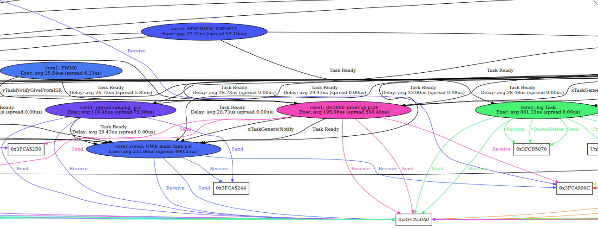
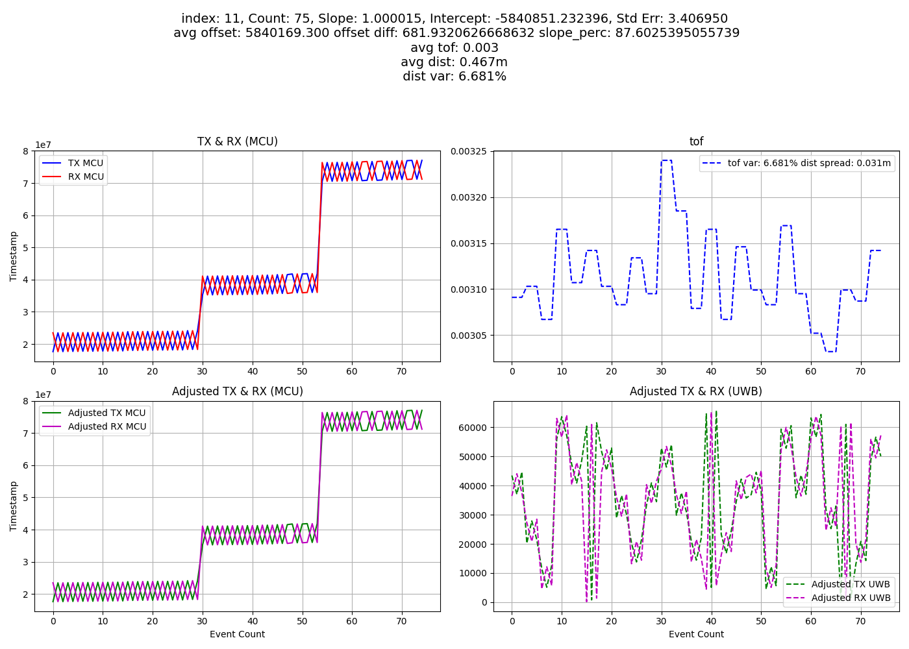
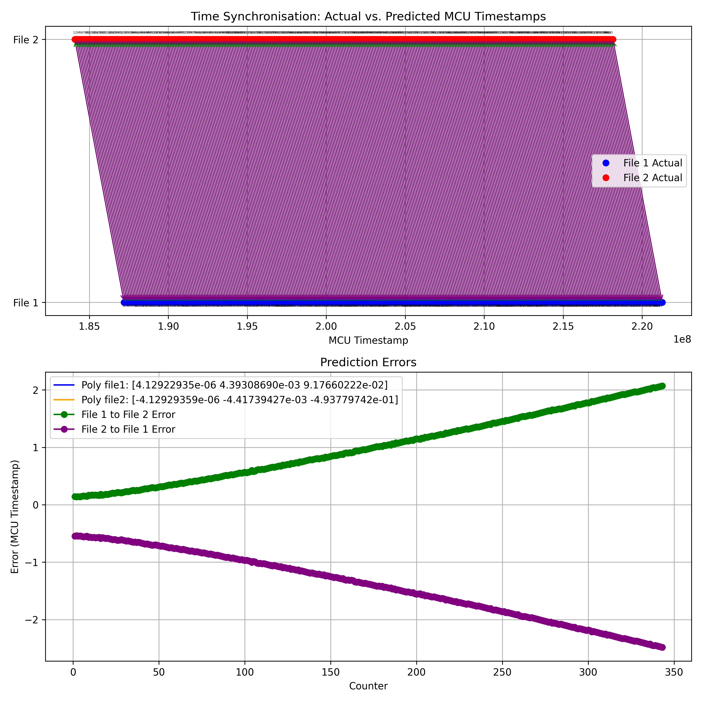
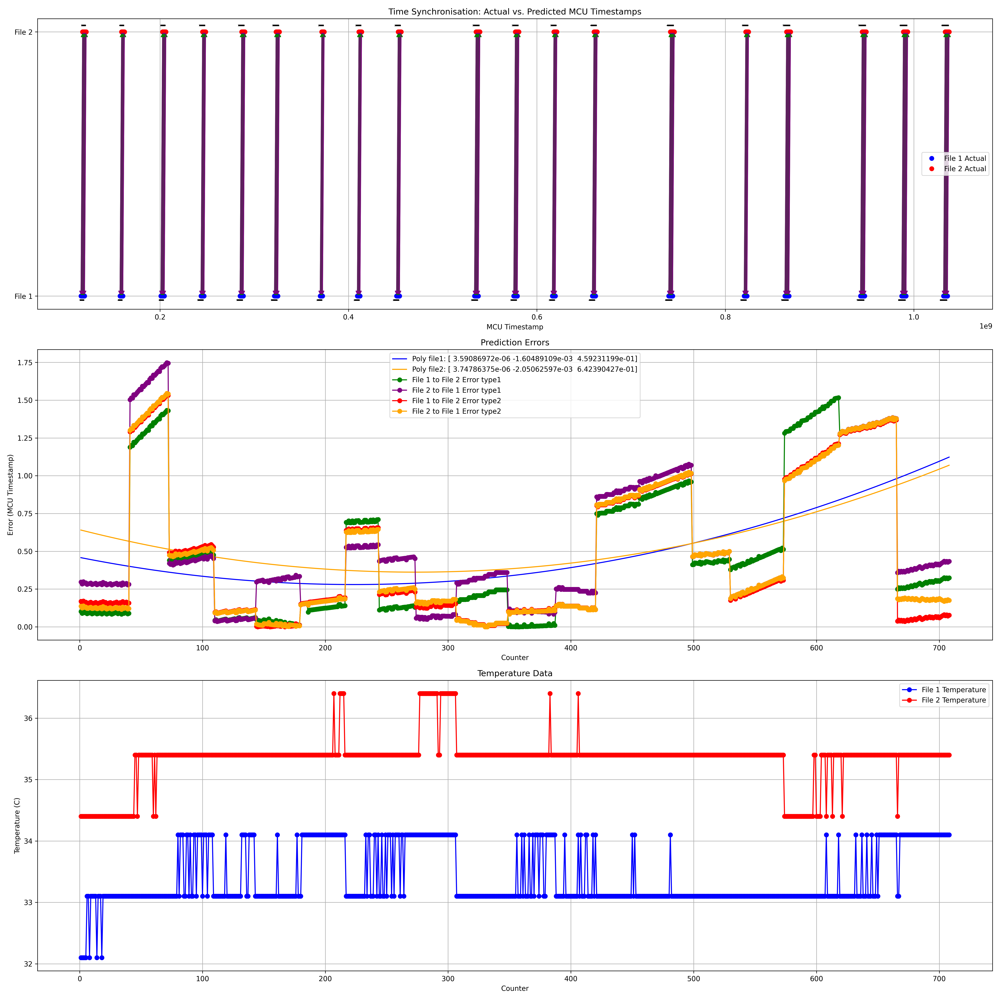
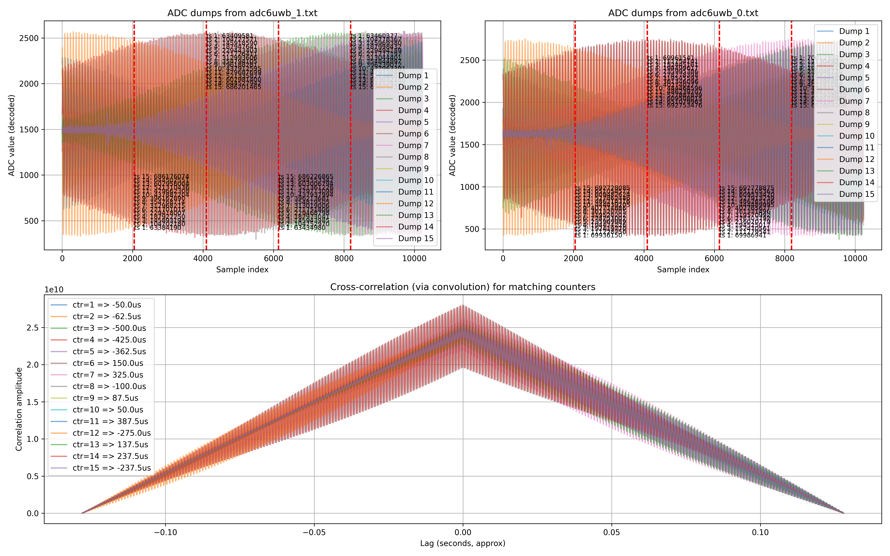

# Time Synchronization Experiments

This project is the firmware for a Time synchronization experiment.
The goal was to establish a sub microsecond time synchronization between two nodes, with limited hardware changes (no sfd led or external crystal).

## Hardware setup 

Each node is made of a esp32s3 with a lora and uwb transceiver.

UWB is used to establish the time synchronization, while lora is used to send the time synchronization data.

## debug tools

As part of thsi project I wrote a few debug tools to help with the evaluation of the time synchronization.
This results in some intresting plots.

---

This is a graph of the back trace from the critical loop obtained via gdb.

---

This is a graph of one the different scenarios that can occur during the critical loop. This vue has more breadth than the previous one.

---

This is a part of a graph that shows how different tasks interact with each other.

## evaluation

This plot shows the evolution over time of teh data used for time sync. 

--- 

This plot shows the evolution of the error of the time sync over time. The error is the difference between the time of the node and the time of the master node. The evaluation is done by capturing a ground truth pulse from a waveform generator at both nodes. You can see that we can achieve a sub microsecond time synchronization, but we can't hold it very long.

---

This plot uses the same experimental setup but showcases the evolution of the error over multiple synchronizations.

---

Here is a different attempt to evaluate the quality of the sync via the correlation of a modulated signal. The results are not trustworthy but still interesting. 